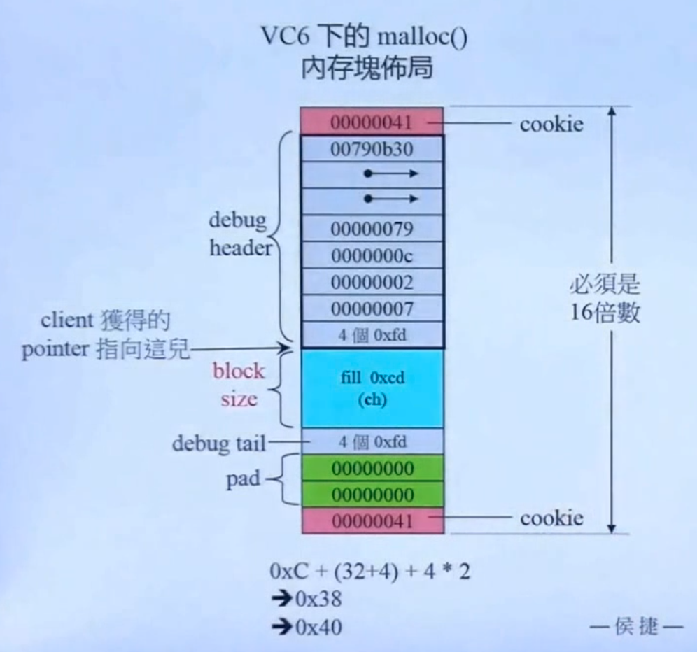

## CPP内存管理入门初探
### 代码内容大部分引用至侯捷老师
- primitives:基础内存管理手法
- 想要直接调用类构造函数，需要使用placement new
```cpp
//cpp基础内存分配手段测试
void primitives()
{
    //c风格的malloc和free
    void* p1 = malloc(512);	//512 bytes
    free(p1);

    //cpp风格的new和delete
    //new套了一层operator new，而operator new的本质是包装好的malloc
    //如果申请一堆内存，那么new会比malloc多记录一些额外信息，比如一堆内存的大小，方便delete使用
    //delete套了一层operator delete，而operator delete的本质是包装好的free
    //从上述讨论可以看到，如果类里面重载了new操作符，那么当使用new操作符取申请对象时，
    //就会调用到客户重载的new操作符版本了
    complex<int>* p2 = new complex<int>; //one object
    delete p2;             

    void* p3 = ::operator new(512); //512 bytes
    ::operator delete(p3);

    //使用内存分配器进行分配内存
    //一般不使用这个版本，对参数和值需要程序员自己保证，但是在项目中其实很难保证这个事情
    //目前的分配器逻辑，都是生成临时对象，然后分配请求的内存量
    //其本质是操作系统管理的内存池，生成临时子对象，从内存池中申请内存块
    //以下使用 C++ 標準庫提供的 allocators。
    //其接口雖有標準規格，但實現廠商並未完全遵守；下面三者形式略異。
#ifdef _MSC_VER
    //以下兩函數都是 non-static，定要通過 object 調用。以下分配 3 個 ints.
    int* p4 = allocator<int>().allocate(3, (int*)0); 
    allocator<int>().deallocate(p4,3);           
#endif
#ifdef __BORLANDC__
    //以下兩函數都是 non-static，定要通過 object 調用。以下分配 5 個 ints.
    int* p4 = allocator<int>().allocate(5);  
    allocator<int>().deallocate(p4,5);       
#endif
#ifdef __GNUC__
    //以下兩函數都是 static，可通過全名調用之。以下分配 512 bytes.
    //void* p4 = alloc::allocate(512); 
    //alloc::deallocate(p4,512);   
    
    //以下兩函數都是 non-static，定要通過 object 調用。以下分配 7 個 ints.    
	void* p4 = allocator<int>().allocate(7); 
    allocator<int>().deallocate((int*)p4,7);     
	
    //以下兩函數都是 non-static，定要通過 object 調用。以下分配 9 個 ints.	
	void* p5 = __gnu_cxx::__pool_alloc<int>().allocate(9); 
    __gnu_cxx::__pool_alloc<int>().deallocate((int*)p5,9);	
#endif
}
```

### array new,array delete
- 会根据new出对象的大小，决定调用多少次ctor。
- 只调用默认构造函数，如果试图申请一堆类对象，那么目标对象一定要实现默认构造函数。
- 同样，在new的时候调用了多少次ctor，那么在delete时就会调用多少次dtor。
  - 如果array new匹配了普通的delete，那么编译器就只会调用一次dctor。
  - 内存泄露只针对目标对象本身内部持有指针指向堆内存，这种行为导致了内存泄露的后果。
  - 如果目标对象内部只有标准类型，那么行为未定义。
- 而且无法使用参数给予其默认初值。
- array new和new operator在内存块上的布局是不同的
  - new operator：在内存块上布局申请的对象所需要的字节数。
  - array new：在实际存对象的内存之前，还布局有一个整数数值，表明当前申请的对象的数量。
  - 如果不匹配，就会出现内存块匹配错误，那么就会导致core dump，因为内存块上的信息不匹配。
```cpp
class A
{
public:
  int id;
  
  A() : id(0)      { cout << "default ctor. this="  << this << " id=" << id << endl;  }
  A(int i) : id(i) { cout << "ctor. this="  << this << " id=" << id << endl;  }
  ~A()             { cout << "dtor. this="  << this << " id=" << id << endl;  }
};
void test_array_new_and_placement_new()
{
	cout << "\ntest_placement_new().......... \n";	
	
size_t size = 3;
	
{
    //case 1
    //模擬 memory pool 的作法, array new + placement new. 崩潰 

   	A* buf = (A*)(new char[sizeof(A)*size]);
   	A* tmp = buf;   
	   
	cout << "buf=" << buf << "  tmp=" << tmp << endl;	
   	
   	for(int i = 0; i < size; ++i)
	    new (tmp++) A(i);  			//3次 ctor 

	cout << "buf=" << buf << "  tmp=" << tmp << endl;
		    
    //!	delete [] buf;    	//crash. why?
    //因為這其實是個 char array，看到 delete [] buf; 編譯器會企圖喚起多次 A::~A. 
    // 但 array memory layout 中找不到與 array 元素個數 (本例 3) 相關的信息, 
    // -- 整個格局都錯亂 (從我對 VC 的認識而言)，於是崩潰。 
	delete buf;     	//dtor just one time, ~[0]	

	cout << "\n\n";
}

{
    //case 2
    //回頭測試單純的 array new
	
   	A* buf = new A[size];  //default ctor 3 次. [0]先於[1]先於[2])
	         //A必須有 default ctor, 否則 [Error] no matching function for call to 'jj02::A::A()'
   	A* tmp = buf;   
	   
	cout << "buf=" << buf << "  tmp=" << tmp << endl;	
   	
   	for(int i = 0; i < size; ++i)
	    new (tmp++) A(i);  		//3次 ctor 

	cout << "buf=" << buf << "  tmp=" << tmp << endl;
		    
	delete [] buf;    //dtor three times (次序逆反, [2]先於[1]先於[0])	
}

}	
```
### placement new
- placement new允许我们将object构建于allocated memory中，在指定位置构建对象。
- 没有所谓的placement delete，因为placement new根本没有分配memory，也可以说与placement new对应的operator delete为palcement delete。
```cpp
//placement new典型用法
char* buf = new char[1024];
Object* object = new (buf) Object();
```
## cpp典型内存分配过程
- 在这个过程中，套了一层operator new，方便重载的new自行调用。
```cpp
Foo* p =  new Foo(x);
delete p;
//is equvalent to
Foo* p = (Foo*)malloc(sizeof(Foo));
new (p)Foo(x);
p->~Foo();
free(p);
```
## 重载::operator new / ::operator delete
- 注意：这个是全局操作符，重载影响到当前程序的方方面面，如果不是特别需求，不推荐重载。
```cpp
inline void* operator new(size_t size)
{//do something
}
inline void* operator new[](size_t size)
{//do something
}
inline void operator delete(void* ptr)
{//do something
}
inline void operator delete[](void* ptr)
{//do something
}
```
## 重载operator new
```cpp
class Foo{
public:
    void* operator new(size_t);
    //size_t是可选的参数，可写可不写
    void operator delete(void*,size_t);
};

Foo* p = new Foo;
//===>
void* mem = operator new(sizeof(Foo));
p = static_cast<Foo*>(mem);
p->Foo::Foo(1,2);

delete p;
//===>
p->~Foo();
operator delete(p);
```
## 强制使用global scope operator
```cpp
Foo* p = ::new Foo();
::delete p;
```
## placement new
- 可以重载class member operator new()，写出多个版本，前提是每个版本必须有独特的参数列，其中第一个参数必须是size_t，其余参数以new所指定的placement arguments为初值。
- 也可以重载class member operator delete()，写出多个版本，但是它们绝对不会被delete调用。只有当new所调用的ctor抛出exception，才会调用重载的operator delete()。之所以会这样设计，主要用来归还未能完全创建成功的object所占用的memory。
```cpp
class Foo{
public:
    //1 一般的operator new()的重载
    void* operator new(size_t size){
        return malloc(size);
    }
    //2 自定义参数个数的operator new()的重载
    void* operator new(size_t size,long extra){
        return malloc(size + extra);
    }
    //3 一般意义上的operator delete(),对应上面的1
    void operator delete(void*,size_t)
    {}
    //4 对应上面的2重载operator new()
    void operator delete(void*,long)
    {} 
};

```

## static allocator
- 将一个总是分配特定尺寸区块的memory allocator给封装起来，使其可以被重复使用。
```cpp
class allocator
{
private:
    struct obj{
        struct obj* next;   //embedded pointer
    };
public:
    void* allocate(size_t);
    void deallocate(void*,size_t);
private:
    obj* freeStore = nullptr;
    const int CHUNK = 5;
};
void* allocator::allocate(size_t size)
{
    obj* p;
    if(!freeStore)
    {
        //linklist为空，于是申请一大块内存
        size_t chunk = CHUNK * size;
        freeStore = p = (obj*)malloc(chunk);

        //将分配得到的一大块内存，分成一块块小的linked list并且将它们串起来
        for(int i = 0;i < (CHUNK - 1) ; ++i)
        {
            p->next = (obj*)((char*)p + size);
            p = p->next;
        }
        p->next = nullptr;
    }
    p = freeStore;
    freeStore = freeStore->next;
    return p;
}
void allocator::deallocate(void* p,size_t)
{
    ((obj*)p)->next = freeStore;
    freeStore = (obj*)p;
}

class Foo
{
public:
    long L;
    string str;
    static allocator myAlloc;
public:
    Foo(long l):L(l){}
    static void* operator new(size_t size)
    {
        return myAlloc.allocate(size);
    }
    static void operator delete(void* pdead,size_t size)
    {
        return myAlloc.dealloc(pdead,size);
    }
};
allocatot Foo::myAlloc;
```

## new handler
- 当operator new没能申请分配到新的内存空间时，会抛出一个std::bad_alloc exception。
- 在抛出exception之前会先（不止一次的）调用一个可由client指定的handler
    - 以下是new handler的形式和设定方法
    ```cpp
    typedef void(*new_handler)();
    new_handler set_new_handler(new_handler p)throw();
    ```
    - 设计良好的new handler应该具备以下两个特性
      - 让更多的memory可用
      - 调用abort()或exit()

## VC6 malloc()
- 存在着巨大的内存浪费
- VC6、BC5和G2.9的allocator以及G4.9的new_allocator都只是以::operator new和::operator delete完成allocate()和deallocate()，并没有特殊设计，使其适配各大容器。
- 

## std::alloc
- 由free_list[16]和free_list每个元素所指向的单向链表组成。本质上是自己指向自己，自己管理自己。
- 由alloc::allocate()和alloc::deallocate()进行申请和归还。
- 每次申请内存时，都会检查free_list上对应大小的位置，有没有空的还未使用的内存，如果没有，那么就申请当前需要大小的字节的20*2的内存块，比如如果申请96字节内存块大小，那么就申请96*20*2=3840字节的内存，其中20块96字节的内存直接挂在对应位置上，剩下的一半内存放回内存池内以供日后使用。

### embedded pointers
- 嵌入式指针，在分配的每一个内存块上，内含有一个4字节指针，方便alloc对内存块进行链表链接管理，但是给用户之后，该指针会被覆盖，直到alloc重新接管该内存块，才重新对该指针进行置值。
```cpp
//可以表现为如下形式
struct obj{
    struct obj* free_list_link;
};
```