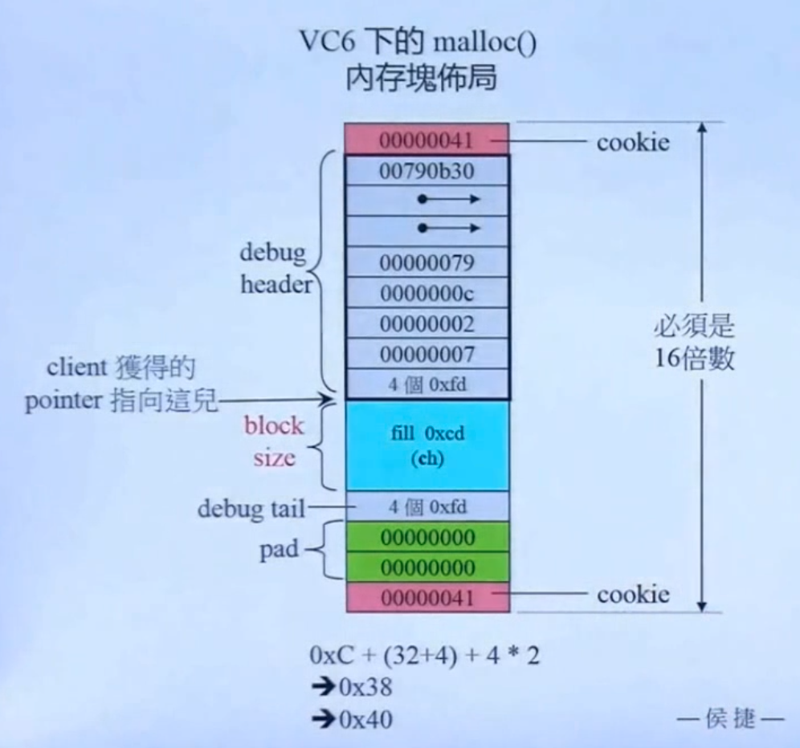

## static allocator
- 将一个总是分配特定尺寸区块的memory allocator给封装起来，使其可以被重复使用。
- 减少向系统申请内存的次数，降低cookie的大小。
```cpp
class allocator
{
private:
    struct obj{
        struct obj* next;   //embedded pointer
    };
public:
    void* allocate(size_t);
    void deallocate(void*,size_t);
private:
    obj* freeStore = nullptr;
    const int CHUNK = 5;
};
void* allocator::allocate(size_t size)
{
    obj* p;
    if(!freeStore)
    {
        //linklist为空，于是申请一大块内存
        size_t chunk = CHUNK * size;
        freeStore = p = (obj*)malloc(chunk);

        //将分配得到的一大块内存，分成一块块小的linked list并且将它们串起来
        for(int i = 0;i < (CHUNK - 1) ; ++i)
        {
            p->next = (obj*)((char*)p + size);
            p = p->next;
        }
        p->next = nullptr;
    }
    p = freeStore;
    freeStore = freeStore->next;
    return p;
}
void allocator::deallocate(void* p,size_t)
{
    //将当前块的next指针指向当前的空闲块
    ((obj*)p)->next = freeStore;
    //再将free_list指针指向当前块
    freeStore = (obj*)p;
}

class Foo
{
public:
    long L;
    string str;
    static allocator myAlloc;
public:
    Foo(long l):L(l){}
    static void* operator new(size_t size)
    {
        return myAlloc.allocate(size);
    }
    static void operator delete(void* pdead,size_t size)
    {
        return myAlloc.dealloc(pdead,size);
    }
};
allocatot Foo::myAlloc;
```

## new handler
- 当operator new没能申请分配到新的内存空间时，会抛出一个std::bad_alloc exception。
- 在抛出exception之前会先（不止一次的）调用一个可由client指定的handler
    - 以下是new handler的形式和设定方法
    ```cpp
    typedef void(*new_handler)();
    new_handler set_new_handler(new_handler p)throw();
    ```
    - 设计良好的new handler应该具备以下两个特性
      - 让更多的memory可用
      - 调用abort()或exit()

## VC6 malloc()
- 存在着巨大的内存浪费
- VC6、BC5和G2.9的allocator以及G4.9的new_allocator都只是以::operator new和::operator delete完成allocate()和deallocate()，并没有特殊设计，使其适配各大容器。
- 

### embedded pointers
- 嵌入式指针，在分配的每一个内存块上，内含有一个4字节指针，方便alloc对内存块进行链表链接管理，但是给用户之后，该指针会被覆盖，直到alloc重新接管该内存块，才重新对该指针进行置值。
- 所以在运行一段时间之后，内存块还是原来的内存块，但是上面指针会变成乱序的
```cpp
//可以表现为如下形式
struct obj{
    struct obj* free_list_link;
};
```
