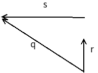
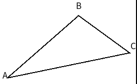

# 第三章:游戏中的线性代数
## 1.给定向量$\vec{a}$=(2,4,6)和$\vec{b}$=(3,5,7),以及标量s=2,计算下面的式子:
### (a)$\vec{a}$+$\vec{b}$
- 答:$\vec{a}$+$\vec{b}$=($a_x$+$b_x$,$a_y$+$b_y$,$a_z$+$b_z$)=(2+3,4+5,6+7)=(5,9,13)
### (b)s*$\vec{a}$
- 答:s*$\vec{a}$=(s*$a_x$,s*$a_y$,s*$a_z$)=(2\*2,2\*4,2*6)=(4,8,12)
### (c)$\vec{a}$X$\vec{b}$
- 答:由c=a\*b-a\*b和xyzzy口诀,以及x$\rightarrow$y$\rightarrow$z$\rightarrow$x的递推关系,设结果为$\vec{c}$,可以得到:
  - $\vec{c_x}$=$\vec{a_y}$\*$\vec{b_z}$-$\vec{a_z}$\*$\vec{b_y}$
  - $\vec{c_y}$=$\vec{a_z}$\*$\vec{b_x}$-$\vec{a_x}$\*$\vec{b_z}$
  - $\vec{c_z}$=$\vec{a_x}$\*$\vec{b_y}$-$\vec{a_y}$\*$\vec{b_x}$
  - 所以:$\vec{c}$=$\vec{a}$X$\vec{b}$=(4\*7-6\*5,6\*3-2\*7,2\*5-4\*5)=(-2,4,-10)
## 2.在向量的正规化方面,有没有什么比较好的经验法则？
- 答:只需要向量的方向时,可以将向量正规化,因为正规化之后的向量只保留方向信息,而需要向量的长度时,则不能将其正规化。
## 3.给定玩家位置为P,怎么高效的比较玩家得到另外两个点A和B的距离远近？
- 答:以玩家点P为原点分别向A点和B点作向量$\vec{a}$和$\vec{b}$,先求出两个向量长度,然后分别比较即可,但是因为向量不可能为0,可以直接比较两个向量的平方,减少运算.
## 4.给定下图中的向量$\vec{q}$和$\hat{r}$,利用向量运算算出$\vec{s}$.
  

- 答:当有单位向量$\hat{r}$和非单位向量$\vec{q}$夹出一个夹角时,延长单位向量到与另外一个向量组成的直角三角形处,这种情况下,点乘会得到单位向量延伸之后的长度,这个长度设为p,有p=$\hat{r}$*$\vec{q}$,从而可以得到新的向量$\vec{p}$=p\*$\hat{r}$,所以$\vec{s}$=$\vec{q}$-$\vec{p}$=$\vec{q}$-$\vec{q}$*$\hat{r}$*$\hat{r}$=$\vec{q}$*(1-$\hat{r^2}$),且因为向量的平方等于向量与自身的点乘,而$\hat{r}$为单位向量,长度为1,所以$\vec{s}$为零向量.
## 5.给出下面的三角形,通过向量计算出夹角$\theta$:
  

### 且:A=(-1,2,2) B=(1,2,3) C=(2,4,3)
- 答:设$\vec{a}$为从A点指向B点的向量,则有$\vec{a}$=B-A=(1-(-1),2-2,3-2)=(2,0,1),$\vec{b}$为A点指向C点的向量,则有$\vec{b}$=(3,2,1).则$\theta$=$\arccos($${\vec{a}\cdot\vec{b}} \over {|\vec{a}||\vec{b}|}$)=$\arccos$${a_x \cdot b_x,a_y \cdot b_y,a_z \cdot b_z} \over {\sqrt{a^2_x+a^2_y+a^2_z} \ast \sqrt{b^2_x+b^2_y+b^2_z}}$
## 6.使用上面的三角形,在右手坐标系下计算出朝书页外方向的法线.
- 答:设法线为$\hat{n}$=$\vec{a}$X$\vec{b}$=($\vec{a_y}$\*$\vec{b_z}$-$\vec{a_z}$\*$\vec{b_y}$,$\vec{a_z}$\*$\vec{b_x}$-$\vec{a_x}$\*$\vec{b_z}$,$\vec{a_x}$\*$\vec{b_y}$-$\vec{a_y}$\*$\vec{b_x}$)
## 7.如果叉乘的顺序改变了,结果会有什么变化？
- 答:叉乘结果改变会导致法线方向改变,从指向书页外方向变成指向书页内.
## 8.如果你被委托实现顶视角动作游戏的立体音效,当声音在游戏世界播放时,你必须判断音源相对于角色的位置来控制音响.这个问题使用向量怎么解决？
- 答:从角色到音源位置作一个单位向量,以及角色当前朝向一个向量,将这两个向量进行点乘,获得夹角.再将两个向量增加一维,进行叉乘计算,获得法线,通过法线的值,即可知道当前音源和角色的位置关系.
## 9.计算下面矩阵相乘的结果:
$$\begin{matrix}1 & 2 & 3 \\4 & 5 & 6 \\7 & 8 & 9 \\\end{matrix}$$
$$\begin{matrix}2 & 0 & 0 \\0 & 2 & 0 \\0 & 0 & 2 \\\end{matrix}$$ 
- 答:
$$\begin{matrix} 1*2+2*0+3*0 & 1*0+2*0+3*0 & 1*0+2*0+3*2 \\4*2+5*0+6*0 & 4*0+5*2+6*0 & 4*0+5*0+6*2 \\7*2+8*0+9*0 & 7*0+8*2+9*0 & 7*0+8*0+9*2 \\\end{matrix}$$ 
## 10.什么情况下矩阵的转置会等于矩阵的逆矩阵？
- 答:逆矩阵:与原矩阵相乘结果为单位矩阵的一种矩阵,转置矩阵:将原矩阵的每一行与每一列进行对换.矩阵是正交矩阵的情况下逆矩阵就是其转置矩阵,比如旋转矩阵.