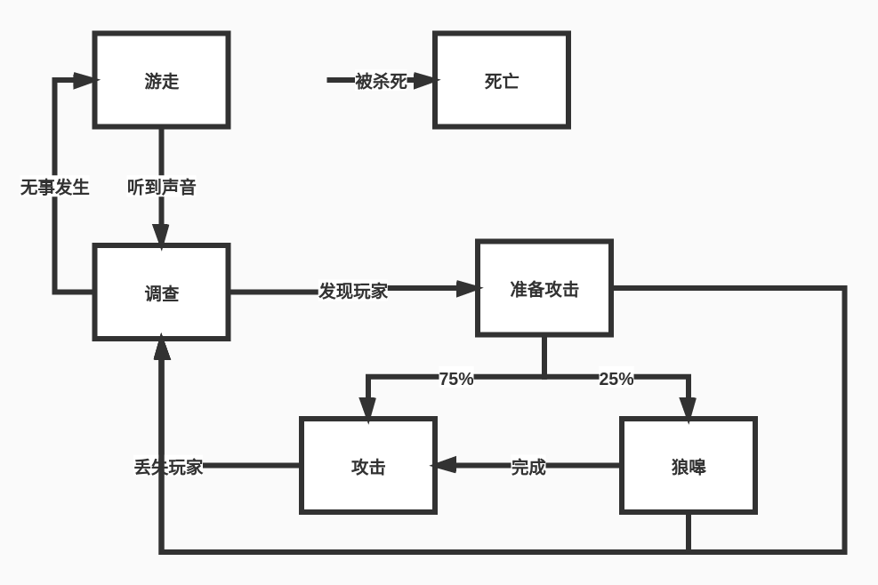

# 第9章:人工智能
## 2.为什么导航网格比路点优越?
- 答:1)寻路返回的路径可以更自然.2)多个不同的游戏对象在同一个场景上进行寻路时,导航网格一份图就可以了,但是路点需要每个对象一份图.3)导航网格可以自动生成.4)导航网格覆盖范围也会更广.
## 3.什么情况下启发式是可取的?
- 答:启发式就是估算某个位置到目标位置的开销.如果这个开销的估算总是小于或者等于真实开销,那么这个启发式就是可取的.
## 4.计算下面两点的曼哈顿距离和欧几里得距离:S(1,1) T(4,4)
- 答:
- $D_欧=\sqrt{(T_x-S_x)^2+(T_y-S_y)^2}=4.245$  
- $D_曼=|T_x-S_x|+|T_y-S_y|=6$ 
## 5.把A*算法应用于下面的例子中.当前节点的相邻节点已经被加入,所以算法需要选择新的当前节点.使用曼哈顿距离为开放集合中的每个节点计算f(x)开销,而且约定不允许对角线行走.哪个节点会被选中为当前节点?
### 临近节点为:(1,4) (3,4) (1,3) (3,3) (2,2),集合中的节点:S1(2,4) S2(2,3) 目标为:T(2,0)
- 答:设(f(x),h(x))为每个节点的开销,且f(x)为当前考虑节点到起始节点的花销,h(x)为当前节点到目标节点的开销,两个开销均采用曼哈顿距离进行计算,则有(1,4)=>(1,5),(3,4)=>(1,5),(1,3)=>(2,4),(3,3)=>(2,4),(2,2)=>(2,2),综上所述,选择位置为(2,2)的节点.
## 6.如果A*算法将启发式改为h(x)=0,哪个算法与此类似?
- 答:Dijkstra算法.
## 7.比较A*和Dijkstra算法.是否其中一个比另一个优越?为什么?
- 答:在游戏开发中,A*相对Dijkstra算法更优越,因为A\*带启发式计算,相对可以减少访问节点数.A\*算法同时考虑开始节点的真实开销和到结束节点的估算开销.而Dijkstra算法则只考虑从开始节点的真实开销.
## 8.为一头狼设计AI,构造一个简单的行为状态机,至少要有5个状态.
- 答:
## 9.状态机设计模式的优点是什么?
- 答:1)代码更清晰,后续需要进行修改更方便.2)使得系统更模块化.3)更方便进行扩展.
## 10.什么是策略,它是如何细分成小组成部分的?
- 答:策略:从AI的视角来完成游戏.将策略细分成一系列特定的目标,AI通过优先级选举系统,进行选择更新当前的策略.
