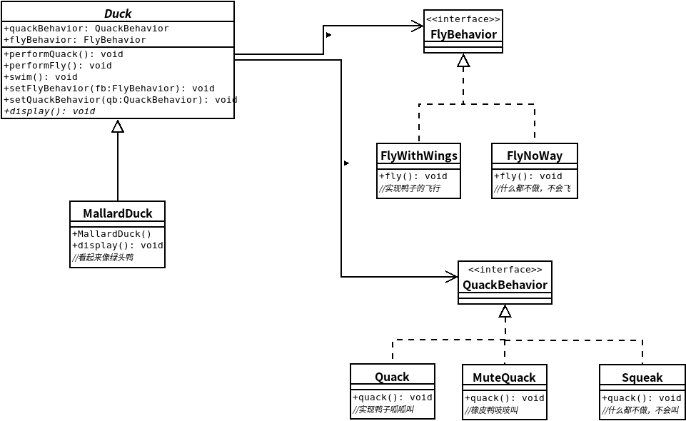

## 策略模式
- ### ***策略模式***定义了算法族，分别封装起来，让它们之间可以相互替换，此模式让算法的变化独立于使用算法的客户。

### 类图

### 代码实现
``` java
//鸭子基类
public abstract class Duck{
    QuackBehavior quackBehavior;
    FlyBehavior flyBehavior;

    public void performQuack(){
        quackBehavior.quakc();
    }

    public void performFly(){
        flyBehavior.fly();
    }

    public void swim(){
        System.out.println("All ducks float,even decoys!");
    }

    public void setFlyBehavior(FlyBehavior fb){
        flyBehavior = fb;
    }

    public void setQuackBehavior(QuackBehavior qb){
        quackBehavior = qb;
    }

    public abstract void display();
    public Duck(){
    }
}
```
``` java
//具体鸭子类别
public class MallardDuck extends Duck{

    public MallardDuck(){
        quackBehavior = new Quack();
        flyBehavior = new FlyWithWings();
    }

    public void display(){
        System.out.println("I'am a real Mallard duck!");
    }
}
```
```java
//FlyBehavior接口类
public interface FlyBehavior{
    public void fly();
}
```
```java
//具体FlyBehavior方法类
public class FlyWithWings implements FlyBehavior{
    public void fly(){
        System.out.println("I'am flying!");
    }
}
public class FlyNoWay implements FlyBehavior{
    public void fly(){
        System.out.println("I can't fly!");
    }
}
```
```java
//QuackBehavior接口类
public interface QuackBehavior{
    public void quack();
}
```
```java
//QuackBehavior具体实现类
public class Quack implements QuackBehavior{
    public void quack(){
        System.out.println("Quack!");
    }
}
public class MuteQuack implements QuackBehavior{
    public void quack(){
        System.out.println("<< Silence >>");
    }
}
public class Squeak implements QuackBehavior{
    public void quack(){
        System.out.println("Squeak!");
    }
}
```
```java
//测试类
public class MiniDuckSimulator{
    public static void main(String[] args){
        Duck mallard = new MallardDuck();
        mallard.performQuack();
        mallard.performFly();
    }
}
```