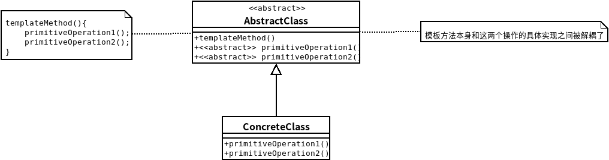

## 模板方法模式
- ### ***模板方法模式***在一个方法中定义了一个算法的骨架，而将一些步骤延迟到子类中。模板方法使得子类可以在不改变算法结构的情况下，重新定义算法中的某些步骤。
- #### 模板方法定义了一个算法步骤，并允许子类为一个或多个步骤提供实现。
- 模板方法中存在一种特殊方法：钩子，只有空的或者默认的实现。其用途是让子类有能力对算法的不同点进行挂钩。
    

```java
//AbstractClass with hook
public abstract class CaffeineBeverageWithHook {
 
	final void prepareRecipe() {
		boilWater();
		brew();
		pourInCup();
		if (customerWantsCondiments()) {
			addCondiments();
		}
	}
 
	abstract void brew();
 
	abstract void addCondiments();
 
	void boilWater() {
		System.out.println("Boiling water");
	}
 
	void pourInCup() {
		System.out.println("Pouring into cup");
	}
 
	boolean customerWantsCondiments() {
		return true;
	}
}
//ConcreteClass with hook
public class CoffeeWithHook extends CaffeineBeverageWithHook {
 
	public void brew() {
		System.out.println("Dripping Coffee through filter");
	}
 
	public void addCondiments() {
		System.out.println("Adding Sugar and Milk");
	}
 
	public boolean customerWantsCondiments() {

		String answer = getUserInput();

		if (answer.toLowerCase().startsWith("y")) {
			return true;
		} else {
			return false;
		}
	}
 
	private String getUserInput() {
		String answer = null;

		System.out.print("Would you like milk and sugar with your coffee (y/n)? ");

		BufferedReader in = new BufferedReader(new InputStreamReader(System.in));
		try {
			answer = in.readLine();
		} catch (IOException ioe) {
			System.err.println("IO error trying to read your answer");
		}
		if (answer == null) {
			return "no";
		}
		return answer;
	}
}
//Client
public class BeverageTestDrive {
	public static void main(String[] args) {
 
		Tea tea = new Tea();
		Coffee coffee = new Coffee();
 
		System.out.println("\nMaking tea...");
		tea.prepareRecipe();
 
		System.out.println("\nMaking coffee...");
		coffee.prepareRecipe();

 
		TeaWithHook teaHook = new TeaWithHook();
		CoffeeWithHook coffeeHook = new CoffeeWithHook();
 
		System.out.println("\nMaking tea...");
		teaHook.prepareRecipe();
 
		System.out.println("\nMaking coffee...");
		coffeeHook.prepareRecipe();
	}
}
```
