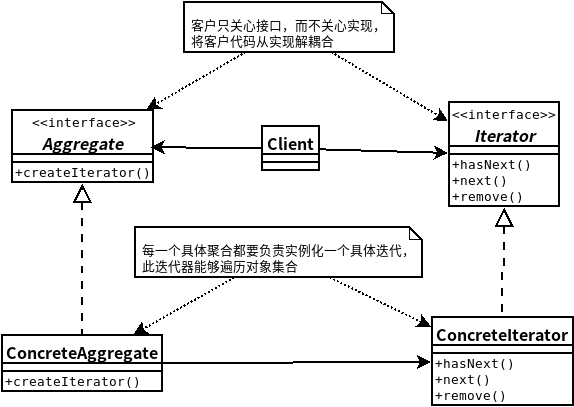

## 迭代器模式
- ### ***迭代器模式***提供一种方法顺序访问一个聚合对象中的各个元素，而又不暴露其内部的表示。
- #### 迭代器模式让我们能游走于聚合内的每一个元素，而又不暴露其内部的表示。
- #### 把游走的任务放在迭代器上，而不是聚合上。这样简化了聚合的接口和实现，也让责任各得其所。
    

```java
//Iterator
public interface Iterator {
	boolean hasNext();
	MenuItem next();
}
//ConcreteIterator
public class ArrayListIterator implements Iterator {
	ArrayList<MenuItem> items;
	int position = 0;
 
	public ArrayListIterator(ArrayList<MenuItem> items) {
		this.items = items;
	}
 
	public MenuItem next() {
		MenuItem item = items.get(position);
		position = position + 1;
		return item;
	}
 
	public boolean hasNext() {
		if (position >= items.size()) {
			return false;
		} else {
			return true;
		}
	}
}
//AggregateItem
public class MenuItem {
	String name;
	String description;
	boolean vegetarian;
	double price;
 
	public MenuItem(String name, 
	                String description, 
	                boolean vegetarian, 
	                double price) 
	{
		this.name = name;
		this.description = description;
		this.vegetarian = vegetarian;
		this.price = price;
	}
  
	public String getName() {
		return name;
	}
  
	public String getDescription() {
		return description;
	}
  
	public double getPrice() {
		return price;
	}
  
	public boolean isVegetarian() {
		return vegetarian;
	}
	public String toString() {
		return (name + ", $" + price + "\n   " + description);
	}
}
//Aggregate
public interface Menu {
	public Iterator createIterator();
}
//ConcreteAggregate
public class PancakeHouseMenuIterator implements Iterator {
	ArrayList<MenuItem> items;
	int position = 0;
 
	public PancakeHouseMenuIterator(ArrayList<MenuItem> items) {
		this.items = items;
	}
 
	public MenuItem next() {
		MenuItem item = items.get(position);
		position = position + 1;
		return item;
	}
 
	public boolean hasNext() {
		if (position >= items.size()) {
			return false;
		} else {
			return true;
		}
	}
}
//Client
public class Waitress {
	Menu pancakeHouseMenu;
	Menu dinerMenu;
 
	public Waitress(Menu pancakeHouseMenu, Menu dinerMenu) {
		this.pancakeHouseMenu = pancakeHouseMenu;
		this.dinerMenu = dinerMenu;
	}
 
	public void printMenu() {
		Iterator pancakeIterator = pancakeHouseMenu.createIterator();
		Iterator dinerIterator = dinerMenu.createIterator();

		System.out.println("MENU\n----\nBREAKFAST");
		printMenu(pancakeIterator);
		System.out.println("\nLUNCH");
		printMenu(dinerIterator);

	}
 
	private void printMenu(Iterator iterator) {
		while (iterator.hasNext()) {
			MenuItem menuItem = iterator.next();
			System.out.print(menuItem.getName() + ", ");
			System.out.print(menuItem.getPrice() + " -- ");
			System.out.println(menuItem.getDescription());
		}
	}
 
	public void printVegetarianMenu() {
		printVegetarianMenu(pancakeHouseMenu.createIterator());
		printVegetarianMenu(dinerMenu.createIterator());
	}
 
	public boolean isItemVegetarian(String name) {
		Iterator breakfastIterator = pancakeHouseMenu.createIterator();
		if (isVegetarian(name, breakfastIterator)) {
			return true;
		}
		Iterator dinnerIterator = dinerMenu.createIterator();
		if (isVegetarian(name, dinnerIterator)) {
			return true;
		}
		return false;
	}


	private void printVegetarianMenu(Iterator iterator) {
		while (iterator.hasNext()) {
			MenuItem menuItem = iterator.next();
			if (menuItem.isVegetarian()) {
				System.out.print(menuItem.getName());
				System.out.println("\t\t" + menuItem.getPrice());
				System.out.println("\t" + menuItem.getDescription());
			}
		}
	}

	private boolean isVegetarian(String name, Iterator iterator) {
		while (iterator.hasNext()) {
			MenuItem menuItem = iterator.next();
			if (menuItem.getName().equals(name)) {
				if (menuItem.isVegetarian()) {
					return true;
				}
			}
		}
		return false;
	}
}
```