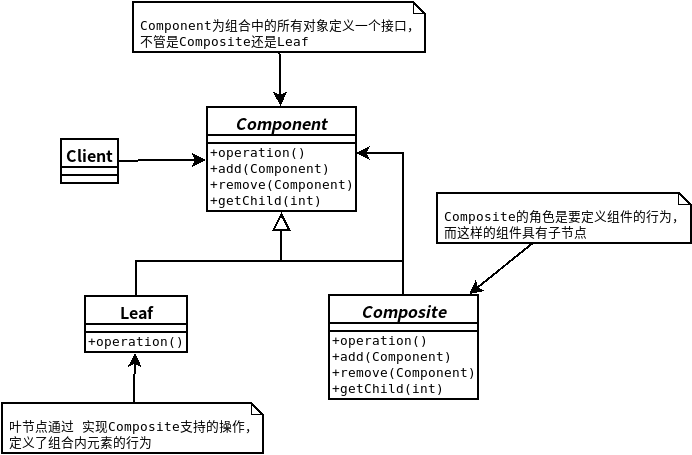

## 组合模式
- ### ***组合模式***允许你将对象组合成树型结构来表现“整体/部分”层次结构。组合能让客户以一致的方式处理个别对象以及对象组合。
- 使用组合结构，我们能把相同的操作应用在组合和个别对象上。换句话说，在大多数情况下，我们可以忽略对象组合和个别对象之间的差别。
    

```java
//Component
public abstract class MenuComponent {
   
	public void add(MenuComponent menuComponent) {
		throw new UnsupportedOperationException();
	}
	public void remove(MenuComponent menuComponent) {
		throw new UnsupportedOperationException();
	}
	public MenuComponent getChild(int i) {
		throw new UnsupportedOperationException();
	}
  
	public String getName() {
		throw new UnsupportedOperationException();
	}
	public String getDescription() {
		throw new UnsupportedOperationException();
	}
	public double getPrice() {
		throw new UnsupportedOperationException();
	}
	public boolean isVegetarian() {
		throw new UnsupportedOperationException();
	}
  
	public void print() {
		throw new UnsupportedOperationException();
	}
}
//Composite
public class Menu extends MenuComponent {
	ArrayList<MenuComponent> menuComponents = new ArrayList<MenuComponent>();
	String name;
	String description;
  
	public Menu(String name, String description) {
		this.name = name;
		this.description = description;
	}
 
	public void add(MenuComponent menuComponent) {
		menuComponents.add(menuComponent);
	}
 
	public void remove(MenuComponent menuComponent) {
		menuComponents.remove(menuComponent);
	}
 
	public MenuComponent getChild(int i) {
		return (MenuComponent)menuComponents.get(i);
	}
 
	public String getName() {
		return name;
	}
 
	public String getDescription() {
		return description;
	}
 
	public void print() {
		System.out.print("\n" + getName());
		System.out.println(", " + getDescription());
		System.out.println("---------------------");
  
		Iterator<MenuComponent> iterator = menuComponents.iterator();
		while (iterator.hasNext()) {
			MenuComponent menuComponent = 
				(MenuComponent)iterator.next();
			menuComponent.print();
		}
	}
}
//Leaf
public class MenuItem extends MenuComponent {
	String name;
	String description;
	boolean vegetarian;
	double price;
    
	public MenuItem(String name, 
	                String description, 
	                boolean vegetarian, 
	                double price) 
	{ 
		this.name = name;
		this.description = description;
		this.vegetarian = vegetarian;
		this.price = price;
	}
  
	public String getName() {
		return name;
	}
  
	public String getDescription() {
		return description;
	}
  
	public double getPrice() {
		return price;
	}
  
	public boolean isVegetarian() {
		return vegetarian;
	}
  
	public void print() {
		System.out.print("  " + getName());
		if (isVegetarian()) {
			System.out.print("(v)");
		}
		System.out.println(", " + getPrice());
		System.out.println("     -- " + getDescription());
	}
}
//Client
public class Waitress {
	MenuComponent allMenus;
 
	public Waitress(MenuComponent allMenus) {
		this.allMenus = allMenus;
	}
 
	public void printMenu() {
		allMenus.print();
	}
}
```