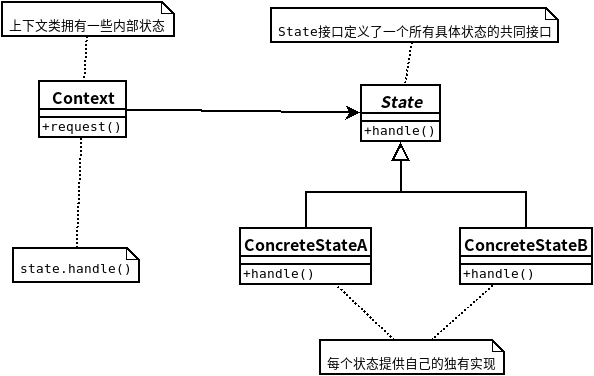

## 状态模式
- ### ***状态模式***允许对象在内部状态改变时改变它的行为,对象看起来好像修改了它的类。

    

```java
//State
public interface State {
 
	public void insertQuarter();
	public void ejectQuarter();
	public void turnCrank();
	public void dispense();
	
	public void refill();
}
//ConcreteState
public class HasQuarterState implements State {
	GumballMachine gumballMachine;
 
	public HasQuarterState(GumballMachine gumballMachine) {
		this.gumballMachine = gumballMachine;
	}
  
	public void insertQuarter() {
		System.out.println("You can't insert another quarter");
	}
 
	public void ejectQuarter() {
		System.out.println("Quarter returned");
		gumballMachine.setState(gumballMachine.getNoQuarterState());
	}
 
	public void turnCrank() {
		System.out.println("You turned...");
		gumballMachine.setState(gumballMachine.getSoldState());
	}

    public void dispense() {
        System.out.println("No gumball dispensed");
    }
    
    public void refill() { }
 
	public String toString() {
		return "waiting for turn of crank";
	}
}
//Context
public class GumballMachine {
 
	State soldOutState;
	State noQuarterState;
	State hasQuarterState;
	State soldState;
 
	State state;
	int count = 0;
 
	public GumballMachine(int numberGumballs) {
		soldOutState = new SoldOutState(this);
		noQuarterState = new NoQuarterState(this);
		hasQuarterState = new HasQuarterState(this);
		soldState = new SoldState(this);

		this.count = numberGumballs;
 		if (numberGumballs > 0) {
			state = noQuarterState;
		} else {
			state = soldOutState;
		}
	}
 
	public void insertQuarter() {
		state.insertQuarter();
	}
 
	public void ejectQuarter() {
		state.ejectQuarter();
	}
 
	public void turnCrank() {
		state.turnCrank();
		state.dispense();
	}
 
	void releaseBall() {
		System.out.println("A gumball comes rolling out the slot...");
		if (count != 0) {
			count = count - 1;
		}
	}
 
	int getCount() {
		return count;
	}
 
	void refill(int count) {
		this.count += count;
		System.out.println("The gumball machine was just refilled; it's new count is: " + this.count);
		state.refill();
	}

	void setState(State state) {
		this.state = state;
	}
    public State getState() {
        return state;
    }

    public State getSoldOutState() {
        return soldOutState;
    }

    public State getNoQuarterState() {
        return noQuarterState;
    }

    public State getHasQuarterState() {
        return hasQuarterState;
    }

    public State getSoldState() {
        return soldState;
    }
 
	public String toString() {
		StringBuffer result = new StringBuffer();
		result.append("\nMighty Gumball, Inc.");
		result.append("\nJava-enabled Standing Gumball Model #2004");
		result.append("\nInventory: " + count + " gumball");
		if (count != 1) {
			result.append("s");
		}
		result.append("\n");
		result.append("Machine is " + state + "\n");
		return result.toString();
	}
}
```