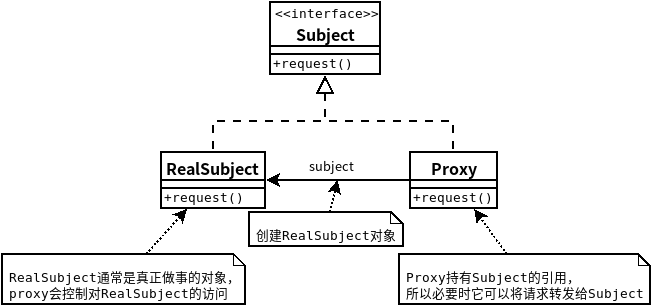

## 代理模式
- ### ***代理模式***为另一个对象提供一个替身或占位符以控制这个对象的访问。
- 使用代理模式创建代表(representative)对象,让代表对象控制某对象的访问,被代理的对象可以是远程的对象、创建开销大的对象或需要安全控制的对象.
- 远程代理管理客户和远程对象之间的交互.
- 虚拟代理控制访问实例化开销大的对象.
- 保护代理基于调用者控制对象方法的访问.
- 代理模式的变体:缓存代理、同步代理、防火墙代理和写入时复制代理.
    - 代理模式类图
    
    - 动态代理类图
    
```java
//Subject
public interface Image {
   void display();
}
//RealSubject
public class RealImage implements Image {
 
   private String fileName;
 
   public RealImage(String fileName){
      this.fileName = fileName;
      loadFromDisk(fileName);
   }
 
   @Override
   public void display() {
      System.out.println("Displaying " + fileName);
   }
 
   private void loadFromDisk(String fileName){
      System.out.println("Loading " + fileName);
   }
}
//Proxy
public class ProxyImage implements Image{
 
   private RealImage realImage;
   private String fileName;
 
   public ProxyImage(String fileName){
      this.fileName = fileName;
   }
 
   @Override
   public void display() {
      if(realImage == null){
         realImage = new RealImage(fileName);
      }
      realImage.display();
   }
}
//test
public class ProxyPatternDemo {
   
   public static void main(String[] args) {
      Image image = new ProxyImage("test_10mb.jpg");
 
      // 图像将从磁盘加载
      image.display(); 
      System.out.println("");
      // 图像不需要从磁盘加载
      image.display();  
   }
}
```