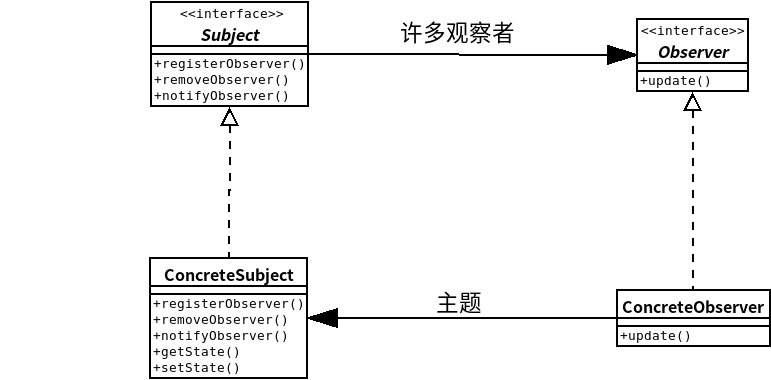
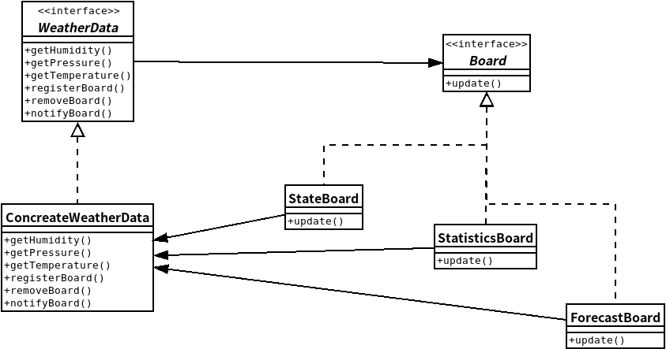
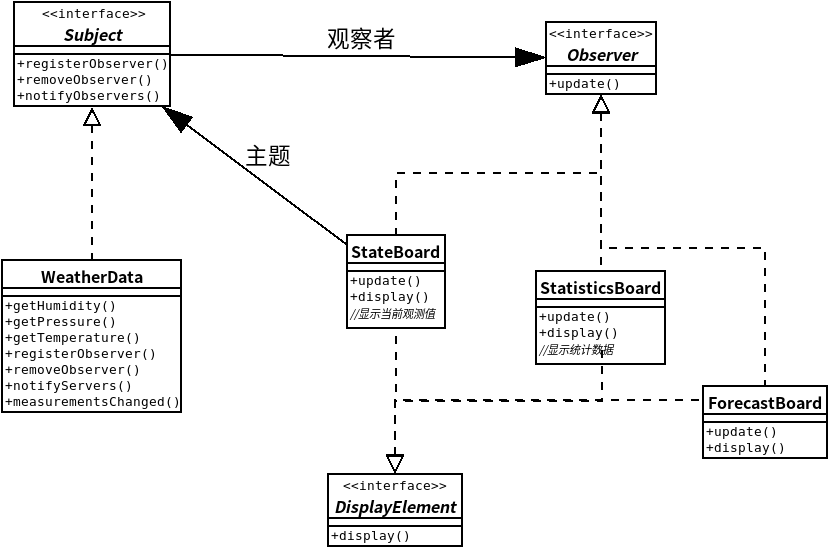
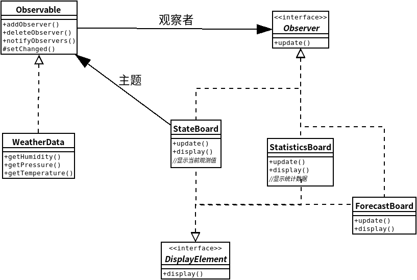

## 观察者模式
- ### ***观察者模式***定义了对象之间的一对多依赖,这样一来,当一个对象改变状态时,它的所有依赖者都会收到通知并自动更新。
- ### 观察者模式定义了一系列对象之间的一对多关系.
- ### 当给一个对象改变状态,其他依赖者都会收到通知.

## 观察者模式-类图


--- 
## 思考题--气象站
WeatherData对象追踪目前的天气状况（温度、湿度、气压）

有三种布告板,分别显示目前的状况、气象统计及简单的预报

而且需要一组API,方便日后新增布告板

#### 初次尝试设计-类图-初版


#### 观察者模式-类图-终版


--- 

### 接口类实现
```java
//主题接口
public interface Subject{
    public void registerObserver(Observer o);
    public void removeObserver(Observer o);
    public void notifyObservers();
}

//观察者接口
public interface Observer{
    public void update(float temp,float humidity,float pressure);
}

public interface DisplayElement{
    public void display();
}
```

### 具体类实现
```java
//主题接口的具体实现
public class WeatherData implements Subject{
    private ArrayList observers;
    private float temperature;
    private float humidity;
    private float pressure;

    public WeatherData(){
        observers = new ArrayList();
    }

    public void registerObserver(Observer o){
        observers.add(o);
    }

    public void removeObserver(Observer o){
        int i = Observers.indexOf(o);
        if( i >= 0){
            observers.remove(i);
        }
    }

    public void notifyObservers(){
        for( int i = 0;i < observers.size();i++){
            Observer observer = (Observer)observers.get(i);
            observer.update(temperature,humidity,pressure);
        }
    }

    public void measurementsChanged(){
        notifyObservers();
    }

    public void setMeasurements(float temperature, float humidity,float pressure){
        this.temperature = temperature;
        this.humidity = humidity;
        this.pressure  = pressure;
        measurementsChanged();
    }
}

//当前状态展板
public class StateBoard implements Observer,DisplayElement{
    private float temperature;
    private float humidity;
    private Subject weatherData;

    //需要一个主题作注册用
    public StateBoard(Subject weatherData){
        this.weatherData = weatherData;
        this.humidity = humidity;
        display();
    }

    public void display(){
        System.out.println("Current conditions:" + temperature + " F degrees and " + humidity + "% humidity" );
    }
}
/*以下两个展板的实现基本类似,在此不再详述.*/
```

### 测试程序
```java
public class WeatherStation{

    public static void main(String[] args){
        WeatherData weatherData = new WeatherData();
        StateBoard stateBoard = new StateBoard(weatherData);
        StatisticsBoard statisticsBoard = new StatisticsBoard(weatherData);
        ForecastBoard forecastBoard = new ForecastBoard(weatherData);

        weatherData.setMeasurements(80,65,30.4f);09
    }
} 
```
---
## java内置的观察者模式类图

---
### 代码帖
```java
import java.util.Observable;
import java.util.Observer;
//重构ForecastDisplay类
public class ForecastDisplay implements Observer,DisplayElement{
    private float currentPressure = 29.92f;
    private float lastPrerssure;

    public ForecastDisplay(Observable observable){
        observable.addObserver(this);
    }

    public void update(Observable observable,Object arg){
        if(observable instanceof WeatherData){
            WeatherData weatherData = (WeatherData)observable;
            lastPrerssure = currentPressure;
            currentPressure = weatherData.getPressure();
        }
    }

    public void display(){

    }
}
```
--- 
### 对于每一个设计原则,描述观察者模式如何遵循此原则.
- #### 找出程序中会变化的方面,然后将其和固定不变的方面相分离.
    - [答]:抽象出公有的主题接口和观察者接口,其余具体实现再在接口的基础上增添自己的细节.
    - 在观察者模式中,会改变的是主题的状态,以及观察者的数目和类型.用这个模式,你可以改变依赖于主题状态的对象,却不必改变主题.这就叫提前规则！

- #### 针对接口编程,不针对实现编程
    - [答]:在主题类中,实现了update操作,针对接口编程,不关心传进来的参数具体类型是什么.
    - 主题与观察者都使用接口:观察者利用主题的接口向主题注册,而主题利用观察者接口通知观察者.这样可以让两者之间都运作正常,而又同事具有松耦合的优点.

- #### 多用组合,少用继承
    - [答]: 观察者通过将主题设为自己的属性之一,使用组合,而不是继承来使用主题的方法.
    - 观察者模式利用“组合”将许多观察者组合进主题中,对象之间的这种关系不是通过继承产生的,而是在运行时利用组合的方式而产生的.