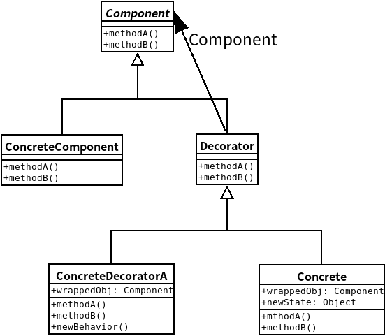

## 装饰器模式
- ### ***装饰器模式***动态地将责任附加到对象上。若要扩展功能，装饰器提供了比继承更具弹性的替代方案。



---

## 设计案例-咖啡点单系统设计

#### 购买咖啡时，有多种咖啡可以选择，而且可以加入各种调料，根据调料不同收取各种费用。

```java
//组件基类
public abstract class Beverage{
    String description = "Unknown Beverage";

    public String getDescription(){
        return description;
    }

    public abstract double cost();
}

//装饰器基类
public abstract class CondimentDecorator extends Beverage{
    public abstract String getDescriotion();
}
```

```java
//具体组件对象
public class Espresso extends Beverage{

    public Espresso(){
        description = "Espresso";
    }

    public double cost(){
        return 1.99;
    }
}

public class HouseBlend extends Beverage{
    
    public HouseBlend(){
        description = "House Blend Coffee";
    }

    public double cost(){
        return 0.89;
    }
}
```

```java
//具体装饰器类
public class Mocha extends CondimentDecorator{
    Beverage beverage;

    public Mocha(Beverage beverage){
        this.beverage = beverage;
    }

    public String getDescription(){
        return beverage.getDescription() + ", Mocha";
    }

    public double cost(){
        return 0.20 + beverage.cost();
    }
}

public class Soy extends CondimentDecorator{
    Beverage beverage;

    public Soy(Beverage beverage){
        this.beverage = beverage;
    }

    public String getDescription(){
        return beverage.getDescription() + ", Soy";
    }

    public double cost(){
        return 0.15 + beverage.cost();
    }
}

public class Whip extends CondimentDecorator{
    Beverage beverage;

    public Whip(Beverage beverage){
        this.beverage = beverage;
    }

    public String getDescription(){
        return beverage.getDescription() + ", Whip";
    }

    public double cost(){
        return 0.10 + beverage.cost();
    }
}
```

```java
//测试代码
public class StarBUzzCoffee{
    
    public static void main(String[] args){
        Beverage beverage = new Espresso();
        System.out.println(beverage.getDescription() + " $" + beverage.cost());

        Beverage beverage2 = new DarkRoast();
        beverage2 = new Mocha(beverage2);
        beverage2 = new Mocha(beverage2);
        beverage2 = new Whip(beverage2);
        System.out.println(beverage2.getDescription() + " $" + beverage2.cost());
    } 
}
```


