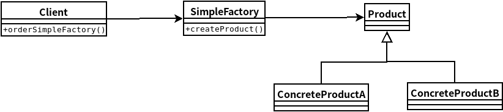

## 简单工厂模式
- ### ***简单工厂模式***定义一个类，封装了所有具体产品类的实现，通过需求的不同来创建不同的产品类。



```java
//简单工厂代码
public class SimpleFactory{

    public Product createProduct(String type){
        Product product = null;

        if(type.equlas("ConcreteProductA")){
            product = new ConcreteProductA();
        }
        else if(type.equls("ConcreteProductB")){
            product = new ConcreteProductB();
        }
        return product;
    }
}
```

```java
//客户类代码
public class Client{
    SimpleFactory factory;

    public Client(SimpleFactory factory){
        this.factory = factory;
    }

    public Product orderSimpleFactory(String type){
        Product product;
        product = factory.createProduct(type);
        //接下来写具体产品类的方法

        return product;
    }
}
```