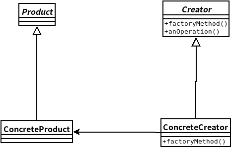

## 工厂方法模式
- ### ***工厂方法模式***定义了一个创建对象的接口，但由子类决定要实例化的类是哪一个。工厂方法让类把实例化推迟到子类。

    

```java
//抽象工厂基类
public abstract class Creator{

    public Product factoryMethod(String type){
        Product product;

        product = createProduct(type);
        //接下来写产品类的方法

        return product;
    }

    abstract Product createProduct(String type);
}
```

```java
//具体工厂类
public class ConcreteCreator extends Creator{
    Product createProduct(String type){
        if(type.equals("ConcreteProductA")){
            return new ConcreteProductA();
        }
        else if(type.equals("ConcreteProductB")){
            return new ConcreteProductB();
        }
        return null;
    }
}
```
```java
//抽象产品基类
public abstract class Product{
    //一些产品的方法
}

//具体产品类
public class ConcreteProductA{
    public ConcreteProductA(){
    }
}
```
```java
//测试
public class Test{
    
    public static void main(String[] args){
        Creator creator = new ConcreteCreator();
        Product product = creator.createProduct("ConcreteProductA");
    }
}
```
