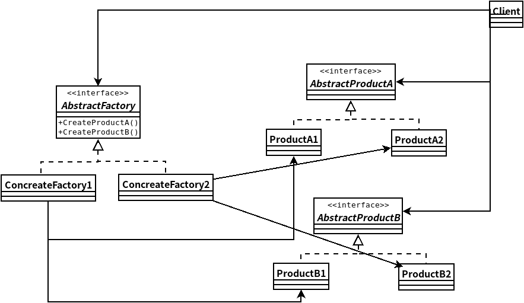

## 抽象工厂模式
- ### ***抽象工厂模式***提供一个接口,用于创建相关或依赖对象的家族,而不需要明确指定具体类。
- 抽象工厂允许客户使用抽象的接口来创建一组相关的产品,而不需要知道（或关心）实际产出的具体产品是什么.这样一来,客户就从具体的产品中被解耦.
- 抽象工厂使用对象组合:对象的创建被实现在工厂接口所暴露出来的方法中.
    

```java
//抽象工厂接口
package headfirst.designpatterns.factory.pizzaaf;
public interface PizzaIngredientFactory {
 
	public Dough createDough();
	public Sauce createSauce();
	public Cheese createCheese();
	public Veggies[] createVeggies();
	public Pepperoni createPepperoni();
	public Clams createClam();
 
}

//具体工厂实现
package headfirst.designpatterns.factory.pizzaaf;

public class NYPizzaIngredientFactory implements PizzaIngredientFactory {
 
	public Dough createDough() {
		return new ThinCrustDough();
	}
 
	public Sauce createSauce() {
		return new MarinaraSauce();
	}
 
	public Cheese createCheese() {
		return new ReggianoCheese();
	}
 
	public Veggies[] createVeggies() {
		Veggies veggies[] = { new Garlic(), new Onion(), new Mushroom(), new RedPepper() };
		return veggies;
	}
 
	public Pepperoni createPepperoni() {
		return new SlicedPepperoni();
	}

	public Clams createClam() {
		return new FreshClams();
	}
}

//抽象产品实现
package headfirst.designpatterns.factory.pizzaaf;

public abstract class Pizza {
	String name;

	Dough dough;
	Sauce sauce;
	Veggies veggies[];
	Cheese cheese;
	Pepperoni pepperoni;
	Clams clam;

	abstract void prepare();

	void bake() {
		System.out.println("Bake for 25 minutes at 350");
	}

	void cut() {
		System.out.println("Cutting the pizza into diagonal slices");
	}

	void box() {
		System.out.println("Place pizza in official PizzaStore box");
	}

	void setName(String name) {
		this.name = name;
	}

	String getName() {
		return name;
	}

	public String toString() {
		StringBuffer result = new StringBuffer();
		result.append("---- " + name + " ----\n");
		if (dough != null) {
			result.append(dough);
			result.append("\n");
		}
		if (sauce != null) {
			result.append(sauce);
			result.append("\n");
		}
		if (cheese != null) {
			result.append(cheese);
			result.append("\n");
		}
		if (veggies != null) {
			for (int i = 0; i < veggies.length; i++) {
				result.append(veggies[i]);
				if (i < veggies.length-1) {
					result.append(", ");
				}
			}
			result.append("\n");
		}
		if (clam != null) {
			result.append(clam);
			result.append("\n");
		}
		if (pepperoni != null) {
			result.append(pepperoni);
			result.append("\n");
		}
		return result.toString();
	}
}

//具体产品实现
package headfirst.designpatterns.factory.pizzaaf;

public class CheesePizza extends Pizza {
	PizzaIngredientFactory ingredientFactory;
 
	public CheesePizza(PizzaIngredientFactory ingredientFactory) {
		this.ingredientFactory = ingredientFactory;
	}
 
	void prepare() {
		System.out.println("Preparing " + name);
		dough = ingredientFactory.createDough();
		sauce = ingredientFactory.createSauce();
		cheese = ingredientFactory.createCheese();
	}
}

//客户类实现
package headfirst.designpatterns.factory.pizzaaf;

public class NYPizzaStore extends PizzaStore {
 
	protected Pizza createPizza(String item) {
		Pizza pizza = null;
		PizzaIngredientFactory ingredientFactory = 
			new NYPizzaIngredientFactory();
 
		if (item.equals("cheese")) {
  
			pizza = new CheesePizza(ingredientFactory);
			pizza.setName("New York Style Cheese Pizza");
  
		} else if (item.equals("veggie")) {
 
			pizza = new VeggiePizza(ingredientFactory);
			pizza.setName("New York Style Veggie Pizza");
 
		} else if (item.equals("clam")) {
 
			pizza = new ClamPizza(ingredientFactory);
			pizza.setName("New York Style Clam Pizza");
 
		} else if (item.equals("pepperoni")) {

			pizza = new PepperoniPizza(ingredientFactory);
			pizza.setName("New York Style Pepperoni Pizza");
 
		} 
		return pizza;
	}
}
```