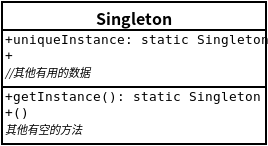

## 单例模式
- ### ***单件模式***确保一个类只有一个实例,并提供一个全局访问点。
    
- 单件模式确保程序中一个类最多只有一个实例.
- 单件模式也提供访问这个实例的全局点.
- 注意:单件模式应用在多线程环境时,可能产生问题.三种解决方案:1、互斥访问接口方法 2、在静态初始化器中创建单件 3、使用双重检查加锁


```java
package headfirst.designpatterns.singleton.classic;

// NOTE: This is not thread safe!

public class Singleton {
	private static Singleton uniqueInstance;
 
	private Singleton() {}
 
	public static Singleton getInstance() {
		if (uniqueInstance == null) {
			uniqueInstance = new Singleton();
		}
		return uniqueInstance;
	}
 
	// other useful methods here
	public String getDescription() {
		return "I'm a classic Singleton!";
	}
}
```