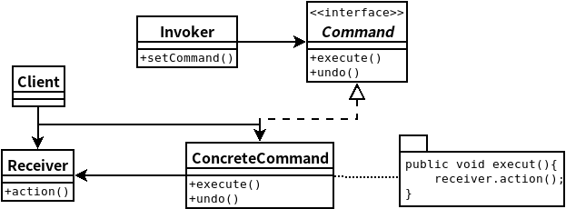

## 8.命令模式
- ### ***命令模式***将“请求”封装成对象,以便使用不同的请求,队列或者日志来参数化其他对象。命令模式也支持可撤销的操作。
- 命令模式将发出请求的对象和接收与执行这些请求的对象分隔开来.
- 在被解耦的两者之间是通过命令对象来沟通的.命令对象封装了接受者的一个或一组动作.
- 调用者通过调用命令对象的execute()发出请求,这会使得接受者的动作被调用.
- 命令模式的更多用途:队列请求和日志请求.
- 宏命令支持对一组命令进行调用执行.
- 命令支持撤销,做法是实现一个undo()方法来回到execute()被执行前的状态.

    

```java
//Command
public interface Command {
	public void execute();
}

//ConcreteCommand
public class LightOffCommand implements Command {
	Light light;
 
	public LightOffCommand(Light light) {
		this.light = light;
	}
 
	public void execute() {
		light.off();
	}
}
public class LightOnCommand implements Command {
	Light light;
  
	public LightOnCommand(Light light) {
		this.light = light;
	}
 
	public void execute() {
		light.on();
	}
}

// This is the invoker
public class SimpleRemoteControl {
	Command slot;
 
	public SimpleRemoteControl() {}
 
	public void setCommand(Command command) {
		slot = command;
	}
 
	public void buttonWasPressed() {
		slot.execute();
	}
}

//receiver
public class Light {

	public Light() {
	}

	public void on() {
		System.out.println("Light is on");
	}

	public void off() {
		System.out.println("Light is off");
	}
}

//client
public class RemoteControlTest {
	public static void main(String[] args) {
		SimpleRemoteControl remote = new SimpleRemoteControl();
		Light light = new Light();
		GarageDoor garageDoor = new GarageDoor();
		LightOnCommand lightOn = new LightOnCommand(light);
		GarageDoorOpenCommand garageOpen = 
		    new GarageDoorOpenCommand(garageDoor);
 
		remote.setCommand(lightOn);
		remote.buttonWasPressed();
		remote.setCommand(garageOpen);
		remote.buttonWasPressed();
    }
	
}
```