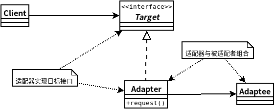
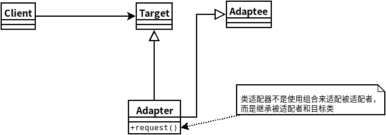

## 适配器模式
- ### ***适配器模式***是将一个类的接口，转换成客户期望的另一个接口。适配器让原本接口不兼容的类可以合作无间。
    - 适配器模式-类图
    
    - 类适配器模式-类图
    

```java
//Target
public interface Duck {
	public void quack();
	public void fly();
}
//ConcreteTarget
public class MallardDuck implements Duck {
	public void quack() {
		System.out.println("Quack");
	}
 
	public void fly() {
		System.out.println("I'm flying");
	}
}
//Adaptee
public interface Turkey {
	public void gobble();
	public void fly();
}
//Adapter
public class TurkeyAdapter implements Duck {
	Turkey turkey;
 
	public TurkeyAdapter(Turkey turkey) {
		this.turkey = turkey;
	}
    
	public void quack() {
		turkey.gobble();
	}
  
	public void fly() {
		for(int i=0; i < 5; i++) {
			turkey.fly();
		}
	}
}
//Client
public class TurkeyTestDrive {
	public static void main(String[] args) {
		MallardDuck duck = new MallardDuck();
		Turkey duckAdapter = new DuckAdapter(duck);
 
		for(int i=0;i<10;i++) {
			System.out.println("The DuckAdapter says...");
			duckAdapter.gobble();
			duckAdapter.fly();
		}
	}
}
```